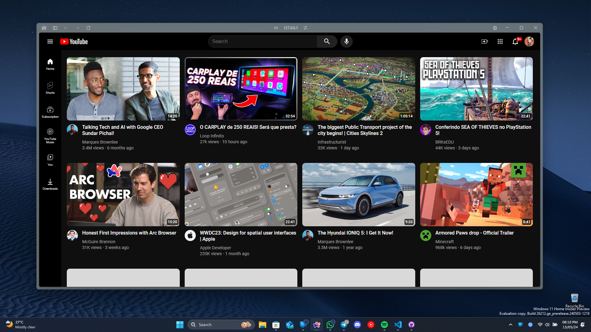

# YouTube Clone - Study Project

This repository contains the code for a simple (for now) YouTube clone website built for learning purposes. 

### Project Preview

### Project Structure

The project uses HTML, CSS, and in the future potentially JavaScript to achieve the basic layout and functionality of a YouTube homepage. Here's a breakdown of the expected files and folders:

* `youtube.html`: The main HTML file for the website.
* `styles`: Folder containing CSS files for styling the website. 
    * `general.css`: Likely contains general styles applied throughout the website.
    * `header.css`:  Styles specific to the header section.
    * `video.css`: Styles specific to the video grid and video previews.
* `images`: Folder containing images used in the website.
    * `header/icons`: Icons used in the header section (hamburger menu, logo, etc.).
    * `channel-pictures`: Profile pictures for the video previews.
    * `thumbnails`: Thumbnails for the video previews.